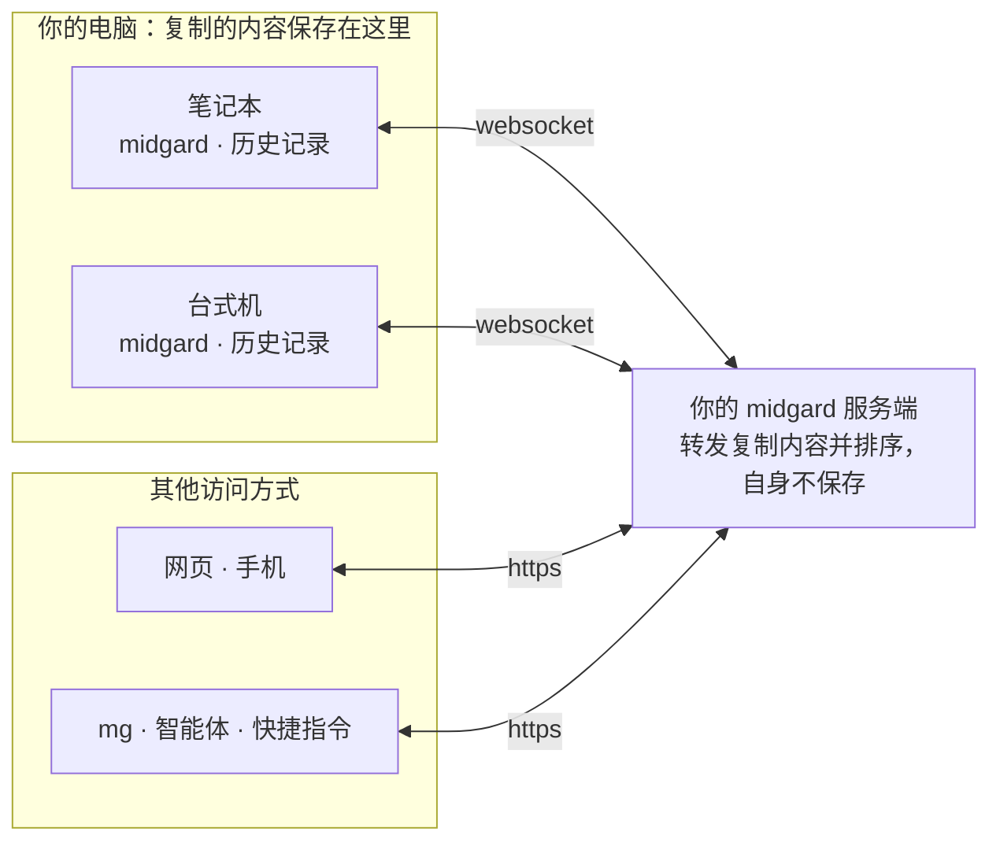

# midgard [](https://github.com/changkun/midgard/actions/workflows/midgard.yml) 

[English](./README.md) | 中文

米德加德（midgard）让你所有设备上的剪贴板保持一致：在一台设备上复制，在另一台上粘贴，并在任何一台上找到昨天复制的内容。可以把复制的内容或文件变成可分享的链接。它运行在你自己的服务器上，只供你允许登录的人使用，支持 macOS、Linux 和 Windows，手机可通过网页和 iOS 快捷指令使用。

## 工作方式



- **复制的内容保存在你的设备上。** 每台设备都保存历史记录，每台上的列表和顺序都相同。
- **服务端不保存任何复制内容。** 它把每次复制从你的一台设备传给其他设备，并为其编号，使所有设备对顺序达成一致；复制内容只在内存中保留到每台设备都收到为止，离线的设备重新上线后会收到。
- **只有你能看到自己的剪贴板。** 所有人都通过 auth.latere.ai 登录，服务端只允许白名单上的人，每个人只能访问自己的剪贴板。

[midgard 的工作方式](./docs/architecture.cn.md)有完整说明：什么保存在哪里、设备离线或服务端重启时会发生什么，以及服务端能看到什么。

## 快速开始

**1. 服务端。** 在一台可公开访问的机器上：

```sh
$ cp config.example.yml config.yml   # 设置 domain
$ cp .env.template .env              # 设置 AUTH_ALLOWED_PRINCIPALS：允许登录的人
$ make build && make up              # 或直接运行：mg server
```

`docker-compose.yml` 会加入一个已有的 traefik 网络；如需使用自己的反向代理，请参阅[安装](./docs/install.cn.md)。

**2. Mac。** 使用 `make mac` 构建应用（需要 Xcode 命令行工具和 Go），然后打开 `apple/build/Midgard.app`。它会询问你的服务端地址、引导你登录，并常驻菜单栏：可将最近的复制内容放回剪贴板，在窗口中查看历史记录，按 **Ctrl+Option+S** 把剪贴板分享为链接。在 Mac 上它取代 `mg daemon`，详见 [Mac 应用](./docs/install.cn.md#mac-应用)。

**3. Linux、Windows，或不使用应用的 Mac。** 从 [releases](https://github.com/changkun/midgard/releases) 下载 `mg`（或使用 `go install changkun.de/x/midgard@latest`，生成的程序名为 `midgard`），然后将以下内容写入配置文件：Linux 为 `~/.config/midgard/config.yml`，macOS 为 `~/Library/Application Support/midgard/config.yml`，Windows 为 `%AppData%\midgard\config.yml`：

```yaml
domain: example.com   # 或 http://your-server:8456
```

```sh
$ mg login            # 通过 auth.latere.ai 登录，只需一次
$ mg daemon install   # 以当前用户身份，无需 sudo
$ mg daemon start
$ mg status
server status: OK
daemon status: OK
```

无法打开浏览器登录的设备以及 iOS 快捷指令，可以改用应用令牌：在服务端运行 `mg server token add <名称> --owner <你>`（详见[使用](./docs/usage.cn.md)）。

现在就可以在一台设备上复制、在另一台上粘贴了。`mg share` 可将剪贴板内容或文件变成链接，详见[使用](./docs/usage.cn.md)。

## 文档

- [安装](./docs/install.cn.md)
- [使用](./docs/usage.cn.md)

## 贡献

参与贡献最简单的方式就是提供反馈。我非常希望听到你认为这个服务缺少些什么。
欢迎提交 [Issue](https://github.com/changkun/midgard/issues/new) 和
[PRs](https://github.com/changkun/midgard/pulls) 提供反馈。

## 致谢

我希望感谢[杨文](https://maiyang.me)和[饶全成](https://qcrao.com)在项目早期进行的有启发性的讨论及测试。

## 许可

版权所有 2020-2021 [欧长坤](https://changkun.de)。保留所有权利。