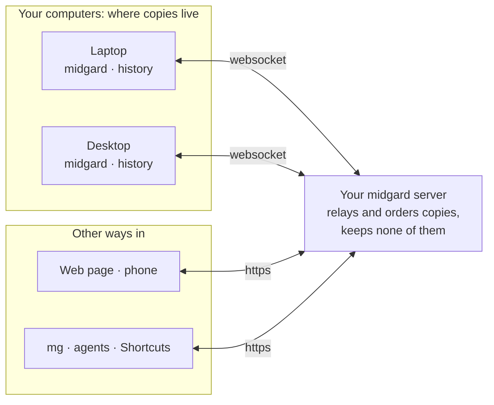

# midgard [](https://github.com/changkun/midgard/actions/workflows/midgard.yml) [](https://pkg.go.dev/changkun.de/x/midgard) 

English | [中文](./README.cn.md)

midgard keeps your clipboard the same on all your devices: copy on one,
paste on another, and find what you copied yesterday on any of them. Turn a
copy or a file into a link to share. It runs on a server you own, for the
people you let sign in, on macOS, Linux and Windows, and on phones through
the web page and iOS Shortcuts.

## How it works



- **Your copies stay on your devices.** Each device keeps the history, the
  same list in the same order on every one.
- **The server keeps none of them.** It passes each copy from one of your
  devices to the others, numbering them so every device agrees on the order,
  and holds a copy in memory only until each device has it: one that was off
  gets it when it comes back.
- **Only you see your clipboard.** Everyone signs in through auth.latere.ai,
  the server lets in the people on its allowlist, and each reaches only their
  own.

[How midgard works](./docs/architecture.md) explains it in full: what is kept
where, what happens while a device is away or the server restarts, and what
the server can see.

## Quick start

**1. The server.** On a machine with a public address:

```sh
$ cp config.example.yml config.yml   # set domain
$ cp .env.template .env              # set AUTH_ALLOWED_PRINCIPALS: who may sign in
$ make build && make up              # or run: mg server
```

`docker-compose.yml` joins an existing traefik network; see
[Installation](./docs/install.md) to put midgard behind your own reverse proxy.

**2. A Mac.** Build the app with `make mac` (Xcode's command line tools and
Go), and open `apple/build/midgard.app`. It asks for your server, signs you
in, and lives in the menu bar: recent copies to put back, the history in a
window, **Ctrl+Option+S** to share the clipboard at a link. It replaces
`mg daemon` on a Mac; see [The Mac App](./docs/install.md#the-mac-app).

**3. Linux, Windows, or a Mac without the app.** Download `mg` from the
[releases](https://github.com/changkun/midgard/releases) (or
`go install changkun.de/x/midgard@latest`, which names it `midgard`), then
put this in `~/.config/midgard/config.yml` on Linux,
`~/Library/Application Support/midgard/config.yml` on macOS, or
`%AppData%\midgard\config.yml` on Windows:

```yaml
domain: example.com   # or http://your-server:8456
```

```sh
$ mg login            # sign in through auth.latere.ai, once
$ mg daemon install   # as yourself, no sudo
$ mg daemon start
$ mg status
server status: OK
daemon status: OK
```

A device that cannot open a browser to sign in, and an iOS Shortcut, can use
an app token instead: `mg server token add <name> --owner <you>` on the server
(see [Usage](./docs/usage.md)).

Now copy something on one device and paste it on another. `mg share` turns the
clipboard, or a file, into a link; see [Usage](./docs/usage.md).

## Docs

- [How midgard works](./docs/architecture.md)
- [Installation](./docs/install.md)
- [Usage](./docs/usage.md)

## Contributes

Easiest way to contribute is to provide feedback! I would love to hear
what you like and what you think is missing.
[Issue](https://github.com/changkun/midgard/issues/new) and
[PRs](https://github.com/changkun/midgard/pulls) are also welcome.

## Acknowledgment

The author of this project would like to thank
[Wen Yang](https://maiyang.me) and [Quancheng Rao](https://qcrao.com)
for their inspiring discussion and testing in the early stage of the midgard.

## License

Copyright 2020-2021 [Changkun Ou](https://changkun.de). All rights reserved.