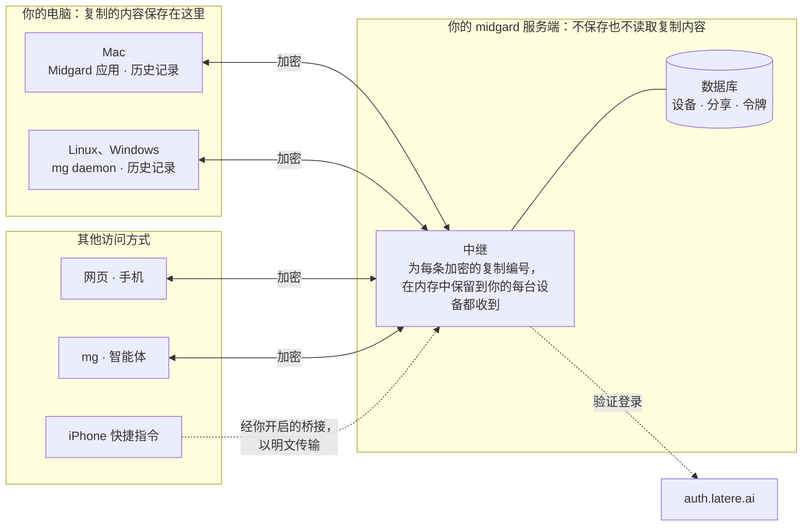
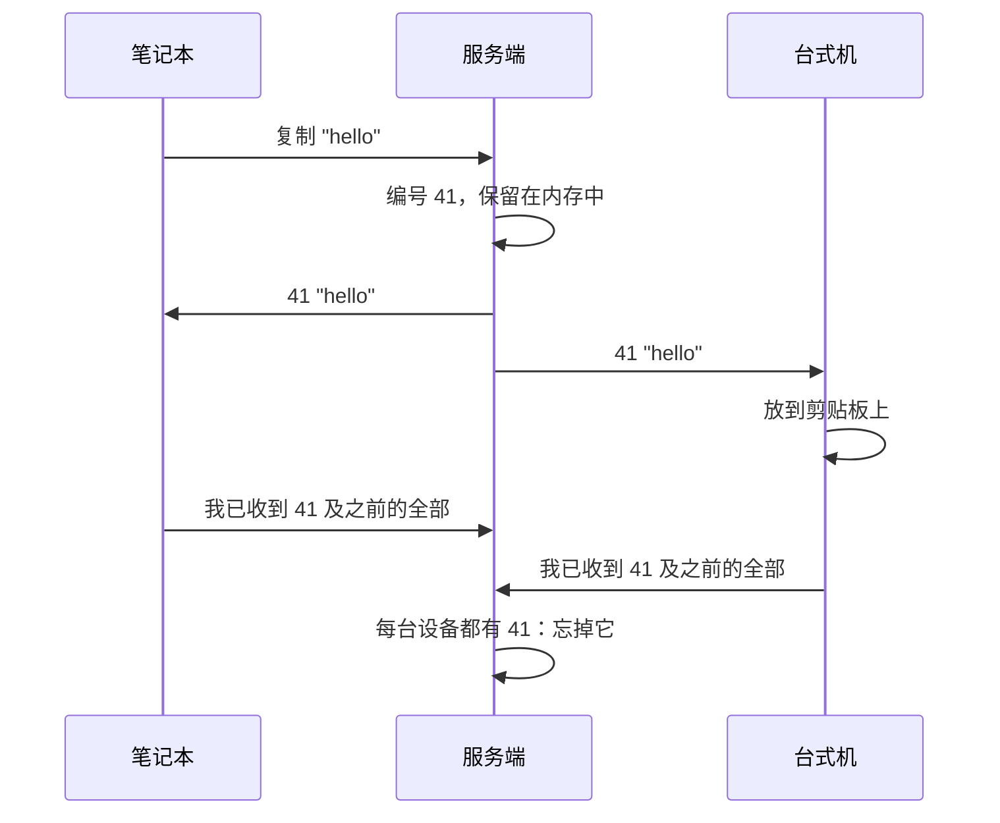
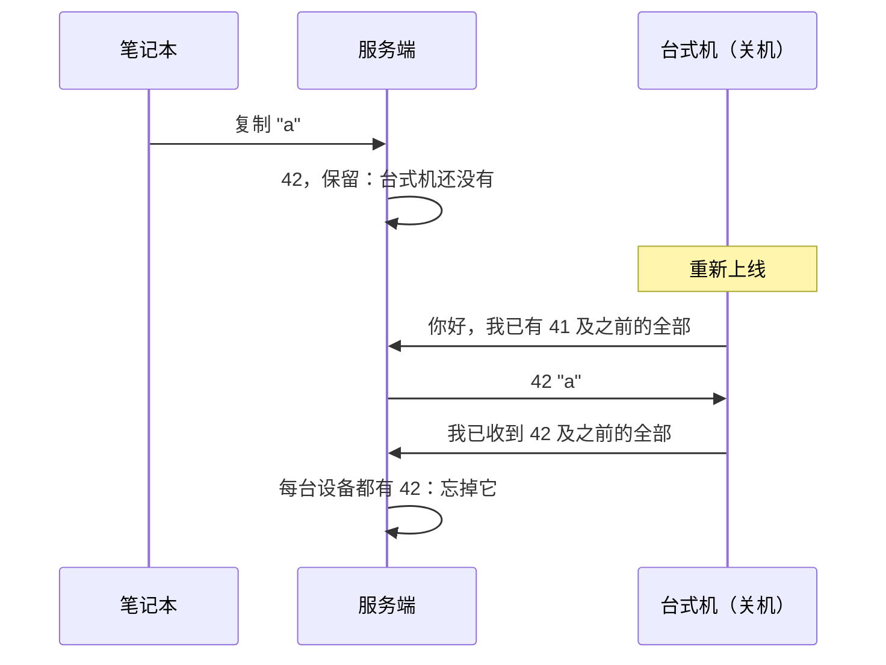
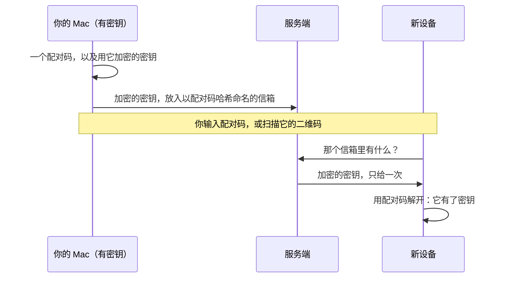

# midgard 的工作方式

[English](./architecture.md) | 中文

midgard 让你所有设备上的剪贴板保持一致。你复制的内容只保存在你的设备上：服务端负责把它从一台设备传给其他设备，自身不保存任何内容，也无法读取，因为你的设备用它们共享的密钥加密了这些内容。

## 什么保存在哪里

| | 你的设备上 | 服务端 | 浏览器中 |
|---|---|---|---|
| 剪贴板历史记录 | 是，每台设备各有一份 | 否 | 否 |
| 正在发往离线设备的复制内容 | | 仅在内存中，且已加密，直到送达 | 网页发送的内容，直到送达 |
| 你的密钥 | 每台已配对的设备上，与登录信息放在一起 | 从不保存，只保存其 ID | 你配对过的浏览器中，无法被读出 |
| 你的设备，以及每台同步到哪里 | | 是 | |
| 分享（你发布的链接） | | 是，直到过期或被撤销 | |
| 应用令牌 | | 仅保存哈希值 | |
| 密码管理器标记为机密的密码 | 从不保存，从不发送 | 从不 | 从不 |

历史记录保存在设备上仅你本人可读的文件中：Linux 为 `~/.local/share/midgard/history.db`，macOS 为 `~/Library/Application Support/midgard/history.db`，Windows 为 `%AppData%\midgard\history.db`。每台设备保留最近 200 条、30 天内、不超过 64 MB 的复制内容，并以相同方式清理旧内容，因此每台设备显示的历史记录都一样。

## 一次复制的旅程

你在笔记本上复制。笔记本上的 midgard 把它发给服务端；服务端为它分配历史记录中的下一个编号，再发给你的每台设备（包括笔记本本身，以便它得知编号）。每台设备都收到后，服务端就把它忘掉。

你的复制内容永远不会到达其他人的设备：每个人的设备在服务端都有各自独立的房间，房间之间不互通。

## 设备离线时

某台设备关机期间的复制内容，会在服务端内存中等待（最多 7 天、64 MB），设备回来后送达。无论是刚复制完就合上的笔记本，还是所有电脑都休眠时从手机发送的内容，都能到达。

不再使用的设备会让复制内容一直等待它。30 天未出现的设备不再计入；你也可以在网页上或用 `mg devices forget` 立即忘掉它。`mg queue` 和网页会显示正在路上的内容，以及它们在等待哪些设备。

## 服务端重启时

服务端不在磁盘上保存复制内容，因此重启会丢失内存中的内容。已到达任何设备的内容不会丢失：离线期间错过内容的设备，会从你另一台在线的设备那里补齐。没有到达任何设备的内容（例如所有电脑都关机时从手机粘贴的内容）会丢失；网页会保留自己发送的内容直到送达，并提供重新发送。

## 所有设备上的同一顺序

每台设备以相同顺序显示相同的历史记录。服务端按到达顺序为你历史记录中发生的一切编号：复制、删除、清空。设备按编号应用这些事件，因此结果一致。

历史记录按每次复制的时间排序。在没有网络的笔记本上复制的内容会较晚到达服务端，但会排在它被复制的时间处，而不会替换你在此期间在另一台设备上复制的更新内容。最新的一条就是你的剪贴板。

从历史记录中删除一条或清空历史，也会以同样方式到达每台设备，但不会改变任何人此刻剪贴板上的内容。

## 网页、手机与 mg

网页和 `mg` 不保存历史记录。它们读取的内容来自你某台在线的设备，以加密形式送达，再用你的密钥解开；没有设备在线时，网页会如实说明。它们复制的内容先加密，再像在设备上复制的一样送达你的设备。智能体和脚本也通过 `mg` 使用 midgard。

在 iPhone 上，网页就能完成所有事情：扫描 Mac 显示的二维码为它配对，再添加到主屏幕。iPhone 快捷指令无法加密，因此只能经由你开启为桥接的 Mac，以明文访问你的复制内容（见下文）。

## 登录

所有人都通过 [auth.latere.ai](https://auth.latere.ai) 登录：设备用 `mg login` 登录一次，网页在浏览器中登录，快捷指令使用你在网页上签发的应用令牌。服务端只允许白名单上的人登录，每个人只能访问自己的剪贴板。

## 加密：服务端能看到什么

你的设备共享一个密钥。每台设备在复制内容离开之前用它加密，收到内容后再解开；服务端转发的是它无法读取的内容。你的第一台连接的设备生成密钥，其他设备通过配对获得它：

配对码是 128 位随机数，服务端无从猜出，只能用一次，十分钟内有效。Mac 应用会显示配对码和二维码，`mg pair` 也会；浏览器可以输入配对码加入，或打开二维码中的链接，链接里的配对码不会发送到服务端。浏览器把密钥保存在无法被读出的地方，因此它不能为其他设备配对。

**服务端仍能看到**的是每条复制内容何时到达、来自你的哪台设备、是文本还是图片、有多大，以及你的哪些设备在线。它为一切编号，因此可以延迟、丢弃或重放它见过的内容，但无法读取复制内容，也无法伪造你的设备会接受的内容。

**这一保证的边界：**

- **网页**来自你的服务端：浏览器中的密钥，其安全程度取决于服务端发送的 JavaScript，以及与它共用同一网址的网站其他部分。Mac 应用、`mg daemon` 和 `mg` 无论服务端发送什么都是安全的。
- **分享**以明文发布，因为链接是给没有你密钥的人看的。
- **快捷指令桥接**，在你开启期间：你为它开启的 Mac，或在 `mg daemon` 的 `config.yml` 中设置了 `plain_bridge: true` 的机器，会把最新的复制内容以明文交给服务端，供“Get from Midgard”读取，并把“Send to Midgard”发来的内容加密后存入。你的服务端能读取这两者，也可以借此发送它自己的内容。

完整设计见 [specs/redesign.md](../specs/redesign.md) §11。
