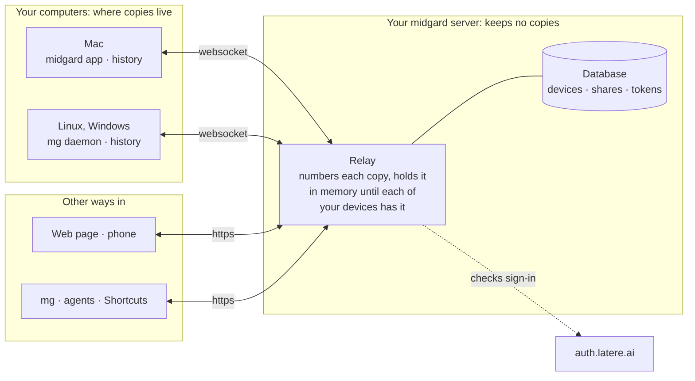
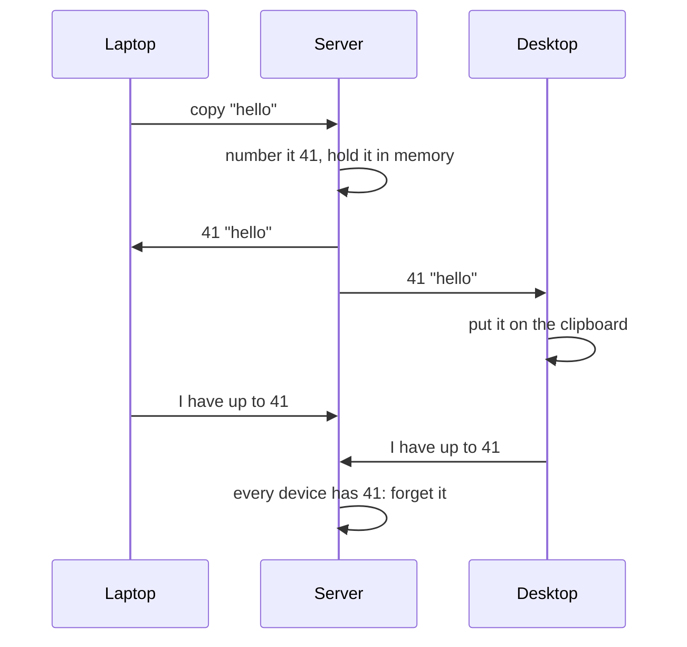
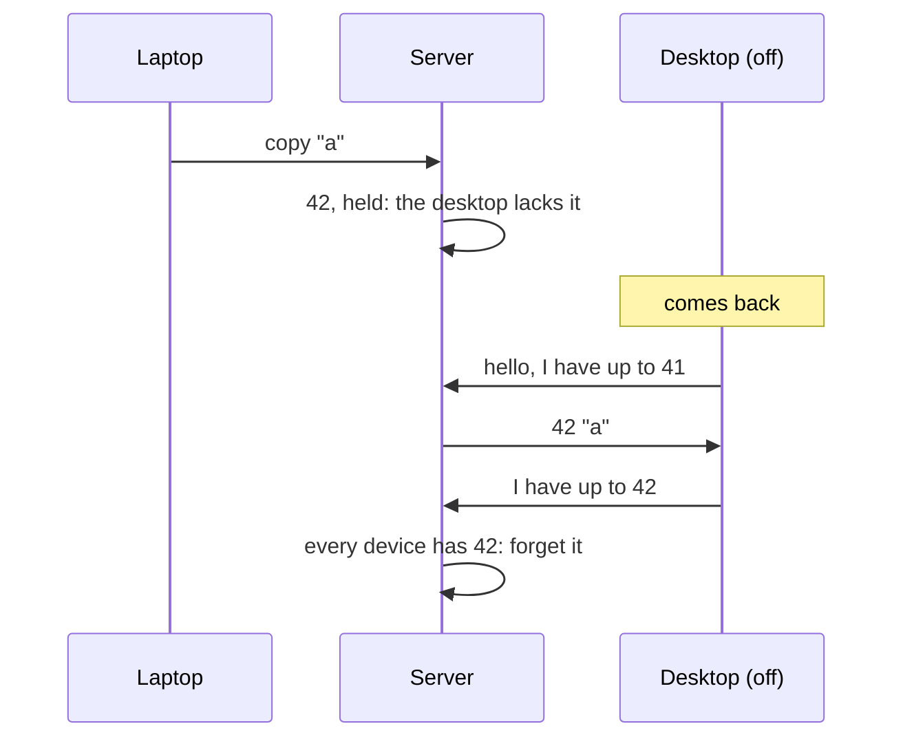

# How midgard works

English | [中文](./architecture.cn.md)

midgard keeps your clipboard the same on all your devices. What you copy
stays on your devices: the server passes it from one device to the others,
and keeps none of it.

## What is where

| | On your devices | On the server | In your browser |
|---|---|---|---|
| Your clipboard history | yes, on each device | no | no |
| A copy on its way to a device that is off | | in memory only, until it arrives | what the web page sent, until it arrives |
| Your devices, and how far each has synced | | yes | |
| Shares (links you published) | | yes, until they expire or you revoke them | |
| App tokens | | a hash of each | |
| Passwords a password manager marks as secret | never kept, never sent | never | never |

On a device the history is a file only you can read:
`~/.local/share/midgard/history.db` on Linux,
`~/Library/Application Support/midgard/history.db` on macOS,
`%AppData%\midgard\history.db` on Windows. Every device keeps the last 200
copies, for 30 days, up to 64 MB, and drops older ones the same way, so each
shows the same history.

## A copy's journey

You copy on your laptop. The laptop's midgard sends it to the server, which
gives it the next number in your history and sends it to each of your
devices, the laptop included, so it learns the number too. Once every device
has it, the server forgets it.

Your copies never reach anyone else's devices: each person's devices are in a
room of their own on the server, and nothing crosses between rooms.

## When a device is away

A copy made while one of your devices is off waits in the server's memory,
for up to 7 days and 64 MB, and reaches the device when it comes back. That
covers a laptop closed right after a copy, and what you send from your phone
while every computer is asleep.

A device you no longer use would keep copies waiting for it. After 30 days
unseen it stops counting, and you can forget it at once, on the web page or
with `mg devices forget`. `mg queue` and the web page show what is on its way,
and to which devices.

## When the server restarts

The server keeps no copies on disk, so a restart loses what it held in
memory. Nothing that reached a device is lost: a device that missed copies
while it was off gets them from another of your devices that is online. What
reached no device at all, such as a phone's paste while every computer was
off, is gone; the web page keeps what it sent until it arrives, and offers to
send it again.

## One order on every device

Every device shows the same history in the same order. The server numbers
everything that happens to your history as it arrives: a copy, a deletion, a
clear. Devices apply events by number, so each ends up the same.

The history is shown by when each copy was made. A copy made on a laptop
without a connection reaches the server late, but takes its place at when it
was made, and it does not replace a newer copy you made on another device in
the meantime. The newest copy is your clipboard.

Deleting a copy from the history, or clearing it, reaches every device the
same way. It does not change what is on anyone's clipboard right now.

## The web page, the phone, and mg

The web page, iOS Shortcuts and `mg` do not keep a history. What they read
comes from one of your devices that is online; when none is, the page says
so. What they copy goes to your devices like a copy made on one of them. `mg`
is also how agents and scripts use midgard.

## Signing in

Everyone signs in through [auth.latere.ai](https://auth.latere.ai): devices
with `mg login` once, the web page in the browser, and a Shortcut with an app
token you issue on the web page. The server lets in only the people on its
allowlist, and each reaches only their own clipboard.

## What the server can see

The server does not keep your copies, but it does see each one while it
passes it on. End-to-end encryption, where your devices share a key and the
server passes on only what it cannot read, is next
([specs/redesign.md](../specs/redesign.md) §11).
