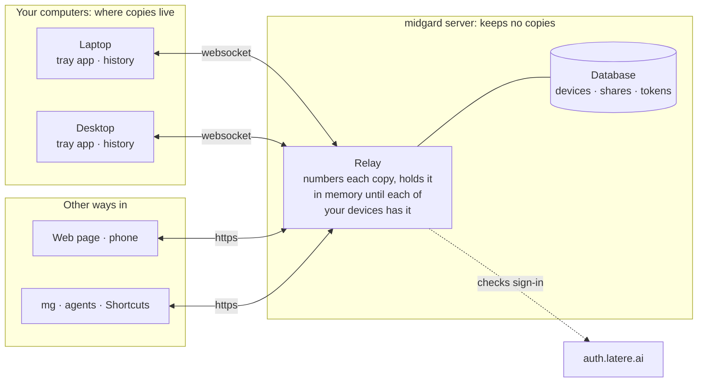
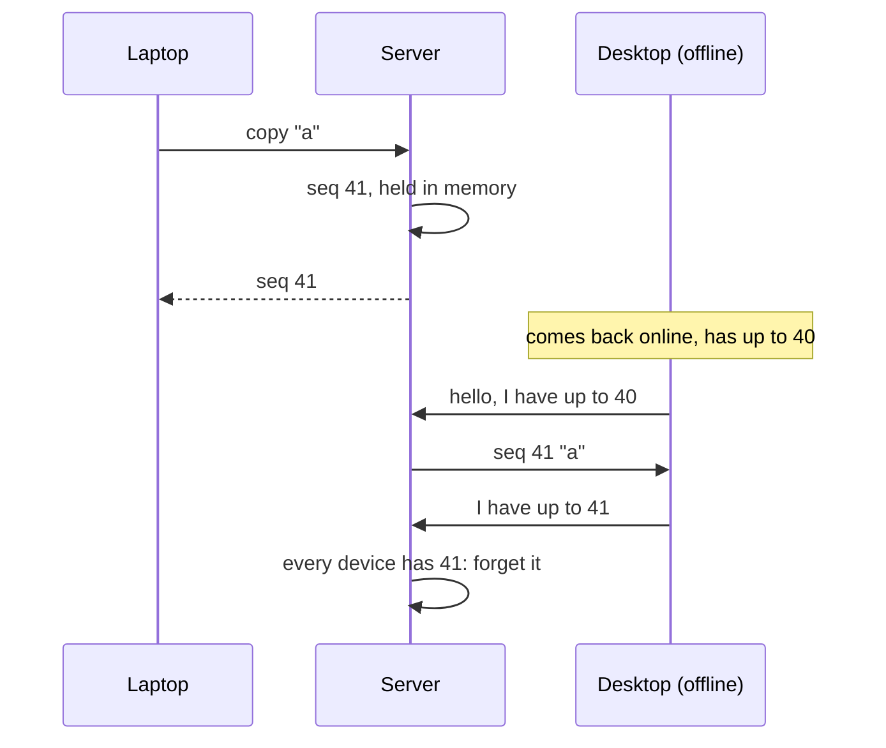

# Design: midgard, redesigned

| | |
|---|---|
| **Status** | Accepted; revised 2026-09-26 (§3, §6–§8, §11–§12); §11, end-to-end encryption, designed 2026-09-26 |
| **Decided** | 2026-09-26, with changkun: clipboards belong to individuals, behind a hard barrier; history is shared across one's own devices; login through auth.latere.ai; code2img and the GitHub backup go; the API stays `/v1` and changes in place |
| **Revised** | 2026-09-26, with changkun: the server keeps no copy of anyone's clipboard, only relays and orders them; history lives on the devices, in one order on all of them; a tray app is what people use, `mg` stays for agents and scripts; end-to-end encryption is a must, after this |
| **Builds on** | #35–#53 (Phase 0 and 1: safe, and easy to run) |

## 1. What midgard is for

Copy on one of your devices, paste on another, and find what you copied
yesterday from any of them. Turn a copy into a link to share. It runs on your
own server, at `changkun.de/midgard`, for the people you let sign in, and no
one sees anyone else's clipboard.

Your copies live on your devices. The server passes them between your devices
and puts them in order, and keeps none of them.

## 2. What stays and what goes

| | Today | After |
|---|---|---|
| Sign-in | one user name and password in `config.yml`, on every device | auth.latere.ai, plus an allowlist |
| Whose clipboard | one, shared by everyone who can log in | one per person, isolated |
| History | every text ever copied, plaintext YAML on disk, never read back | on each of your devices, the same list in the same order; none on the server; sensitive copies never kept |
| On a device | `mg daemon`, a service, and `mg` commands | a tray app; `mg` for agents and scripts |
| Local RPC | `mg` → gRPC → daemon → HTTP → server | `mg` → HTTP → server |
| Backup | the store is a git clone, pushed to GitHub hourly | a data volume with one SQLite file; host backups cover it |
| code2img | server-side Chrome | removed |
| Share links | files under `data/repo`, forever | rows with an owner, optional expiry, revocable |
| Phones | iOS Shortcuts / Tasker with the password | a web page, or Shortcuts with a revocable app token |

## 3. Architecture

- **The server** is the coordination plane. It signs everyone in, knows which
  of a person's devices are online, and passes each copy from one device to
  the others. Every copy it passes gets the next number in that person's
  history, so every device ends up with the same history in the same order
  (§6). A copy waits in the server's memory until each of the person's
  devices has it, then the server forgets it. Nothing of a copy is written to
  the server's disk. Shares are the exception by design: a share is something
  you published, and its link must work while your devices sleep (§9).
- **The tray app** is what people use on a computer. It watches the
  clipboard, applies what arrives, keeps the history, and shows it: a menu of
  recent copies to put back, and a window to search, preview and delete them.
  It runs in the person's desktop session, where the clipboard is, and starts
  at login. It drops copies marked sensitive (#53) before they are shared or
  kept, and turns the hotkey into a share.
- **`mg`** stays, for agents and scripts: copy to your devices, read your
  clipboard and history, share, as text or JSON. It calls the server; what it
  reads, the server asks one of your online devices for. It also runs the
  server and its admin commands, and a headless sync for a machine without a
  desktop.
- **The web page and Shortcuts** are clients like `mg`: what they read comes
  from an online device, and what they copy is relayed.

## 4. Identity

**People** sign in with auth.latere.ai. A signature proves *who* is calling,
not that they may use this server, so `AUTH_ALLOWED_PRINCIPALS` (emails or
principal ids, as `main` and `redir` use) decides who may. The principal id
(`sub`) is the owner key for everything they store.

**Devices** — the daemon and `mg`, which are one program — sign in once with
`mg login`: the device grant (RFC 8628, `latere.ai/x/pkg/authkit/cli`) prints
a code, the person approves it in a browser, and the login token is kept in
`<UserConfigDir>/midgard/token.json`. For each server call the device mints a
short-lived actor token for audience `midgard` (`oidc.MintActorToken`) and
reuses it until it expires. The server verifies signature, issuer, expiry and
audience from the JWKS (`authkit.JWT`, `Audiences: [midgard]`), then the
allowlist.

**The web page** uses browser code + PKCE with a session cookie
(`latere.ai/x/pkg/authkit/oidc`), as `redir` does, at `/midgard/`, signing in
at `/midgard/.auth/{login,callback,logout}`. The session cookie is midgard's
own (`__Host-midgard-session`, not the library's default name, which `redir`
on the same site uses), lasts 30 days with its access token refreshed
(`offline_access`), and signs in to the API as a third way beside the two
tokens, behind the same allowlist. A request it signs in may change nothing
without the page's CSRF token (`X-CSRF-Token`, double-submitted), and may not
reach the websocket or the profiles, which are for daemons and their
operator. The page runs under a nonce-only Content-Security-Policy and shows
everything as text.

**Shortcuts and Tasker** cannot run a device grant, so the web page issues
*app tokens*: named, shown once, revocable, owned by the person who issued them
(the token store from #48, keyed by owner). They reach only their owner's data.
Only a person signed in, on the page or with a latere token, manages them
(`/tokens`); an app token cannot, or one leaked token could mint more.

The password in `server.auth` goes, and with it basic auth.

**Registration** (in `latere-ai/auth`; where changkun.de's clients are kept is
to be confirmed: `redir`'s is not in `deploy/base/clients.yaml`):

- `midgard-cli`: public; grants `device_code`, `refresh_token`; scopes `openid
  email profile offline_access`; `actor_audiences: [midgard]`. Its own client,
  not a shared one, so its token file and refreshes are its own.
- `midgard-web`: public; code + PKCE; `redirect_uris:
  [https://changkun.de/midgard/.auth/callback, http://localhost:8080/midgard/.auth/callback]`;
  scopes `openid email profile offline_access`; `allowed_origins:
  [https://changkun.de]`. The server then needs `AUTH_CLIENT_ID=midgard-web`
  and an `AUTH_COOKIE_KEY`; without them the page says sign-in is not set up,
  and the API works as before.

## 5. The hard barrier

Every stored row has an `owner` (the `sub`), and every query takes it from the
authenticated request, never from the request body. A device's websocket
joins its owner's room only, and a broadcast never leaves the room. Share links
are public by design, but listing, revoking and creating them are owner-only.

The tests for this are part of each change that touches data: two principals,
each shown to see nothing of the other's clipboard, history, devices, shares or
tokens, through every endpoint.

## 6. History across devices

Each person has one history, and each of their devices keeps a copy of it: the
last 200 copies or 30 days, whichever is fewer, images within 64 MB. The
newest copy is the clipboard. Every device trims the same way, so within that
window every device shows the same list in the same order.

**One order.** The server numbers everything that happens to a person's
history, in the order it arrives: a copy, the deletion of one, a clear. That
number, `seq`, is the order devices apply events in and catch up by. Each copy
also has `time`, when it was made: the server's clock for a copy that arrives
as it is made, and for one made offline, the device's clock corrected by the
offset the server measured when the device reconnected, and no later than its
arrival. History is ordered by `(time, seq)`. So a copy made offline takes its
place at when it was made, and never takes over the clipboard from a newer
copy that another device made in the meantime.

**Each copy once.** A copy of what an older copy holds, the same bytes of the
same types, takes its place: the older one is removed, as the bounds remove a
copy, on each device as it applies the newer. Copying something again, or
putting a copy back from the history, moves it to the top rather than listing
it twice. Every device applies the same events in the same order, so each
removes the same copies; one that arrives out of order, as catching up brings
it, is removed on arrival if a newer copy of it is there.

**Catching up.** A device that connects says the last `seq` it has. The
server sends what it still holds after that. What it no longer holds — it
restarted, or a copy outlived the bounds below — it asks the person's online
devices for, and passes on. If none of them is online, the device waits for
one, and says so.

**Where a copy waits.** The server holds every copy in memory until each of
the person's devices has it, within bounds per person (64 MB, 7 days) past
which the oldest go. A device not seen for 30 days stops counting, and the
tray app and the web page can forget a device. This covers a laptop closed
right after a copy, a phone's paste while every computer is asleep, and the
web page's queue alike. (Decided in review, over holding only what the web
page and Shortcuts send.)

- **The web page's queue** is that buffer: it lists what is still on its way,
  to which devices, and lets one remove a copy that has not arrived yet.
- **Deleting** a copy, or clearing the history, is an event like a copy, so it
  reaches every device in the same order.
- **Copies marked sensitive** never leave the device they were made on, and
  are not kept in its history either.
- **A device** is one install, by a random id it keeps in its configuration
  directory, with its host name to show. Reinstalling makes a new device; the
  old one stops counting after 30 days, or when forgotten.

## 7. Storage

**The server** keeps one SQLite file (`modernc.org/sqlite`, pure Go, so the
server stays one static binary) in the `data` volume, and no clipboard data in
it:

- `devices(id, owner, name, last_seen, acked)`: `acked` is the last `seq` the
  device has.
- `heads(owner, seq)`: the last number given out, so numbers are never reused.
- `shares(slug, path, owner, created, expires, mime, data)`
- `app_tokens(owner, email, name, hash, created)`

Copies on their way are in memory only. A restart loses them; devices then
catch up from each other (§6), and what only the server held — a phone's
paste while every device was off — is gone. The web page keeps what it sent
until it is delivered, and offers to send it again.

**A device** keeps its history in a SQLite file of its own, in its user's data
directory, readable by its user only.

No git. The host's backup of the volume is the backup, and one file copies
consistently with `sqlite3 .backup`.

## 8. Protocol

The API stays at `/midgard/api/v1` and changes in place. No old client
survives the change of sign-in anyway, so a second version would only keep a
path nothing calls.

- `GET /ws`: the websocket, for devices. Typed messages carrying a version;
  a copy's bytes go as binary frames, not base64 inside JSON. A device says
  `hello` with its id, clock and last `seq`; sends `copy`, `delete` and
  `clear`, and `have` when asked for what it holds; receives events with their
  `seq` and `time`, and acknowledges them.
- `POST /clipboard`: copy to one's devices; sequenced like a copy from a
  device. `GET /clipboard`: the newest copy, from the server's memory or else
  from an online device; 503 when no device is online to ask.
- `GET /history`, `GET /history/{seq}`: from an online device. `DELETE
  /history/{seq}`, `DELETE /history`: a delete or clear event.
- `GET /queue`: what is on its way, and to which devices; `DELETE
  /queue/{seq}` takes back a copy no device has yet.
- `GET /devices`, `DELETE /devices/{id}`: one's devices, online or not, and
  forgetting one.
- `POST /shares`, `GET /shares`, `DELETE /shares/{slug}`; `/tokens` as in §4.

`mg`, the web page and Shortcuts use the same endpoints. Endpoints that no
longer fit are removed rather than kept beside the new ones.

## 9. Shares

`POST /shares` stores a copy or a file, and returns `/midgard/s/<id>` (random,
22 characters). The tray app and its hotkey send the bytes; a request without
them shares the newest copy, which the server takes from its memory or asks an
online device for. It may
also ask for a name, `/midgard/<name>`: one namespace for everyone, first
come, first served, free again once its share expires or is revoked. A share
may expire; its owner lists and revokes it (`GET /shares`,
`DELETE /shares/<id>`), and no one else can. Links are public, and served
with `Content-Security-Policy: sandbox` and `nosniff`, so a shared page never
runs as midgard's own origin. Nothing is served from disk any more.

The 74 existing shares on the server move into the table with their old path
as their name, so every link already out there — `/midgard/random/…`,
`/midgard/img/…`, `/midgard/code/…`, and the custom paths — keeps working.
`mg server import --owner ` does it, keeping when each file was made,
leaving hidden files behind, and skipping what it imported before.

## 10. Deployment

As `main` and `redir` are: `/root/changkun.de/midgard` with a
`docker-compose.yml` on the `traefik_proxy` network (the route to
`http://midgard` already exists), an `.env` holding `AUTH_*` and the
allowlist, and `./data` as the volume. Without Chrome the image is a static
binary on a minimal base; it fits the 2 GB host.

At changkun.de/midgard the page shares its origin with the site's other
services, all changkun's own: a script injected into any page of changkun.de
could call midgard's API with a visitor's session and its CSRF token. Shares
cannot, being sandboxed. A host of its own, such as midgard.changkun.de,
would close that, but not for free: every share link already out there is on
changkun.de/midgard, and moving the host moves them too, unless shares stay
on one host and the page moves to another, which is a change of code. midgard
stays at changkun.de/midgard.

Migration: import the shares; the plaintext clipboard history in
`data/logs` (44 MB, 2020–2025) is deleted, not imported: the server keeps no
clipboard data now, and it may hold passwords copied before sensitive copies
were marked. Retire the old checkout.

## 11. End-to-end encryption

Decided 2026-09-26 with changkun (#31): the server passes copies it cannot
read. A person's devices share one key; everything of a copy but its envelope
is sealed with it before it leaves a device, and opened only on another. The
browser may hold the key too, and the iPhone gets a way in both ways: the web
page on its Home Screen, encrypted, and the Shortcuts through a bridge that is
off until you switch it on, in the clear.

### What it protects, and from whom

**From the server**, and anyone who reaches it: its host, its memory, its
logs. It cannot read a copy's bytes, and cannot make a copy the devices
accept.

**What it still sees**: each event's envelope (`seq`, `time`, the device it
came from, its kind, and each format's MIME type and size), which devices are
online, and when. And what it can still do, as it numbers every event: drop,
delay, reorder, or replay a sealed event it has seen, and refuse service.

**Not covered**:

- a device itself: its history stays on it in the clear, readable by its
  person alone, as before;
- shares, published in the clear by design (§9);
- the web page, which the server serves: a key in a browser is as safe as the
  JavaScript the server sends, and as the rest of changkun.de, which shares
  the page's origin (§10). The Mac app, `mg daemon` and `mg` are protected
  whatever the server sends; a browser only while the server is honest;
- the Shortcuts bridge, while switched on (below).

### The key

- One key per person: 256 random bits, made by the person's first device to
  run with encryption. Its id, `kid`, is the first 16 hex digits of
  SHA-256("midgard key id" ‖ key).
- The server keeps the `kid`, never the key: the first device registers it,
  and only when none is set, so two devices cannot both make one. A device
  whose key has another `kid`, or which has none, is told to pair.
- A device keeps the key beside its sign-in (`key.json`, readable by its
  person alone); a browser keeps it in IndexedDB, as a WebCrypto key it cannot
  export.

### What is sealed

The bytes of every copy, and of every preview or copy a device answers with,
to a peer catching up or to a reader such as the web page. Sealing is
AES-256-GCM with a random 96-bit nonce; its additional data is the `kid`,
what the bytes are (a copy or a preview), and the formats (MIME types and
sizes), so the server cannot pass one off as another. The sealed bytes are
the nonce, then the ciphertext and its tag; the envelope says the `kid`.

AES-GCM because the browser holds the key too, and WebCrypto has it; at a
clipboard's pace, random nonces stay far from their limit.

Once a person has a `kid`, the relay refuses a copy that is not sealed, or is
sealed under another `kid`.

### Pairing a device

1. A paired device shows a pairing code: 128 random bits, as 26 letters and
   digits, and as a QR of `https://<server>/midgard/#pair=<code>`. The part
   after `#` never leaves the browser.
2. It seals the key under a key derived from the code (HKDF-SHA-256) and posts
   it to a mailbox on the server, named by a hash of the code. The mailbox
   keeps it for 10 minutes, for one fetch.
3. The new device, given the code (typed, pasted, or the QR opened on a phone),
   fetches the box and opens it.

The server holds a box it cannot open without the code, and 128 bits are too
many to guess. The Mac app shows a code and QR in its Settings; `mg pair`
shows one on a paired machine, and `mg pair <code>` joins; the web page shows
one once paired, and joins by the link or the code.

### Each client

- **Devices** (the Mac app, `mg daemon`) seal what they send and open what
  they receive. The history on a device stays in the clear, as before.
- **`mg`** seals `mg copy` and opens `mg paste` and `mg history show`. Without
  the key it exits with a code of its own, 6, and says to pair.
- **The web page** seals and opens in the browser. Unpaired, it shows the
  devices, the queue, shares and tokens, and asks to pair.
- **Shares** are made by a client that holds the key: it opens the copy and
  publishes its bytes in the clear, as a link is for people without the key.
  The server no longer asks a device for the newest copy to share: **a device
  never hands out its bytes in the clear because the server asked**, or the
  server could have anything it asked for.
- **The iPhone**: the web page on its Home Screen, with Get and Send.
- **The Shortcuts bridge**, off by default. A device where you switch it on
  (the Mac app's Settings, or `plain_bridge: true` in a daemon's
  `config.yml`) pushes the newest copy to the server in the clear, held in
  memory, for Get from Midgard; and takes what Send to Midgard posts, in the
  clear, and seals it into the history as a copy of its own. The server reads
  both, and could send copies of its own through the bridge; the setting and
  the page say so. The Shortcuts call `/api/v1/plain/clipboard`, which
  answers 503 when no bridge is online. The bridge pushes: nothing asks it.

### What changes in the API (§8)

- A copy's `data`, in `POST /clipboard`, `GET /clipboard`, `GET /history`
  (as previews) and `GET /history/{seq}`, is sealed, in base64, with its
  `kid`.
- `GET /key`, and `PUT /key` to register the first `kid` (409 once one is
  set).
- `POST /pair`, a box for 10 minutes; `GET /pair/{id}`, once.
- `PUT` and `GET /plain/clipboard`, the bridge's copy in the clear;
  `POST /plain/clipboard`, from the Shortcuts to the bridge.
- `POST /shares` needs the bytes.

### Moving to it

Devices keep their histories as they are. The first device to run this makes
the key and registers it; each other device pairs once. Until a person has a
key, copies pass as before. Once they have one, an older app or daemon has its
copies refused, and needs updating.

**Not now**: a new key when a device is forgotten. Forgetting a device does
not take the key from it; a new one, sent to the remaining devices by
pairing, would. Also not now: a native mobile app (the web page covers
phones), and peer-to-peer sync on a LAN without the server.

## 12. Plan

Each step is its own PR, with its tests, merged when green.

1. Remove code2img. *Done: #55.*
2. Remove the gRPC service; `mg` commands call the server over HTTP.
   *Done: #56.*
3. Storage: the SQLite schema and store, with the isolation tests.
   *Done: #58, #59.*
4. Identity: JWT verification with the allowlist on the server; `mg login` and
   actor tokens on the device; basic auth removed. Needs §4's registration.
   *Done: #60, #61.*
5. Sync: rooms per person, history, `mg history`. *Done: #62, #63, #64; the
   history moves to the devices in step 8.*
6. Shares, and `mg server import` for the existing ones. *Done: #65, #66;
   `mg share` replaces `mg alloc`, which stays as its alias.*
7. The web page, with browser login and app tokens. *Done: #70; signing in
   waits for `midgard-web`'s registration.*
8. The relay (§6–§8): sequence numbers and the in-memory buffer on the server,
   the history on the devices, catch-up from the buffer and from other
   devices; the server's copies of clips removed; the web page and `mg` read
   through devices. The README and docs explain the architecture with
   diagrams. *Done: 7a7ab7b (internal/wire), 949b0e7 (internal/history),
   79c031d (the switch), ed052f4 (queue and devices in mg and on the page),
   and docs/architecture.md.*
9. The tray app: first a trial of Wails v3 and Fyne on macOS, Windows and
   Linux (tray, window, clipboard watching, the hotkey on macOS's main
   thread), then the app: tray menu, history window, sign-in, start at login.
   `mg daemon` stays for machines without a desktop. *The Mac: done, as a
   native Swift app linking the Go engine as a C library (apple/, built by
   `go build -buildmode=c-archive`, as tailscale/libtailscale is), decided
   with changkun over Wails. Windows and Linux keep `mg daemon` for now.*
10. `mg` for agents: `--json` output, copy from stdin and paste to stdout,
    stable exit codes. *Done: `mg copy`, `mg paste`, `mg history show`,
    `--json`, exit codes 0–5 (docs/usage.md).*
11. Deploy on changkun.de, migrate, and retire the old checkout.
12. End-to-end encryption (§11): the key, sealing and pairing
    (`internal/e2e`); the device engine seals and opens; the relay registers
    the `kid`, refuses what is not sealed, and keeps the pairing mailbox;
    shares made by the client; `mg pair` and exit code 6; pairing in the Mac
    app; the web page with WebCrypto, and on an iPhone's Home Screen; the
    Shortcuts bridge; the end-to-end harness; the docs.
